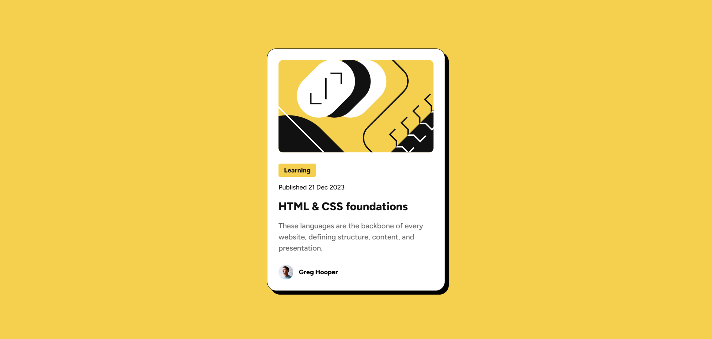

# Blog card

This is a solution to the [Blog preview card challenge on Frontend Mentor](https://www.frontendmentor.io/challenges/blog-preview-card-ckPaj01IcS). Frontend Mentor challenges help you improve your coding skills by building realistic projects. 

## Table of contents

- [Overview](#overview)
  - [The challenge](#the-challenge)
  - [Screenshot](#screenshot)
  - [Links](#links)
- [My process](#my-process)
  - [Built with](#built-with)
- [Author](#author)

## Overview

### The challenge

Users should be able to:

- See hover and focus states for all interactive elements on the page
- View the optimal layout for the interface depending on their device's screen size
- See a 3D tilt effect when hovering over the card

### Screenshot

### Links

- Solution URL: [here!](https://github.com/Mohamed-Devp/blog-card)
- Live Site URL: [here!](https://mohamed-devp.github.io/blog-card/)

## My process

### Built with

- Semantic HTML5 markup
- CSS custom properties
- CSS flexbox

## Author

- Frontend Mentor - [@Mohamed-Devp](https://www.frontendmentor.io/profile/Mohamed-Devp)